# Standaard template-workflows — stroomschema's

Eén schema per proces, automatisch gegenereerd uit de template-stappen (`scripts/gen-workflow-diagrams.ts`). De diagrammen renderen op GitHub. Elke node is een teststap; de volgorde is de happy-path van het proces.

## Inhoud
- **👥 HRM & Payroll** (9)
- **💰 Financieel** (8)
- **🤝 CRM** (5)
- **📊 Projecten & uren** (7)
- **📦 Logistiek / ERP / Inkoop** (7)

## 👥 HRM & Payroll

### Medewerkerdossier beheren

**Subonderdeel:** Medewerkerdossier `(HRM_DOSSIER)`

_Test het aanmaken en bijhouden van een volledig medewerkerdossier inclusief dienstverband, functiemutatie en persoonlijke gegevens in AFAS Profit._

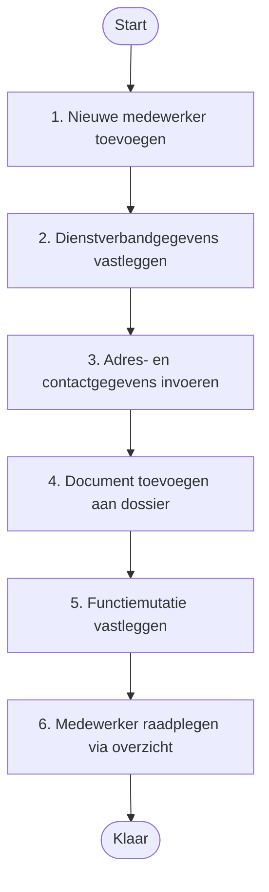

### Werving en selectie (ATS)

**Subonderdeel:** Werving & selectie (ATS) `(HRM_ATS)`

_Test het volledige wervings- en selectieproces in AFAS Profit, van het aanmaken van een vacature tot het aannemen van een geschikte kandidaat._

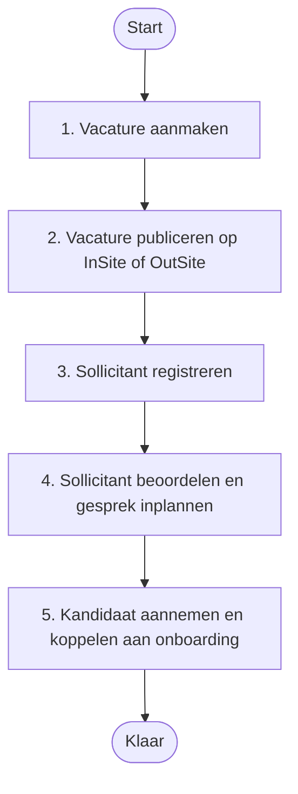

### Onboarding en offboarding

**Subonderdeel:** Onboarding / offboarding `(HRM_ONBOARDING)`

_Test het geautomatiseerde onboarding- en offboardingproces voor nieuwe en vertrekkende medewerkers via AFAS Profit-workflows en InSite-takenlijsten._

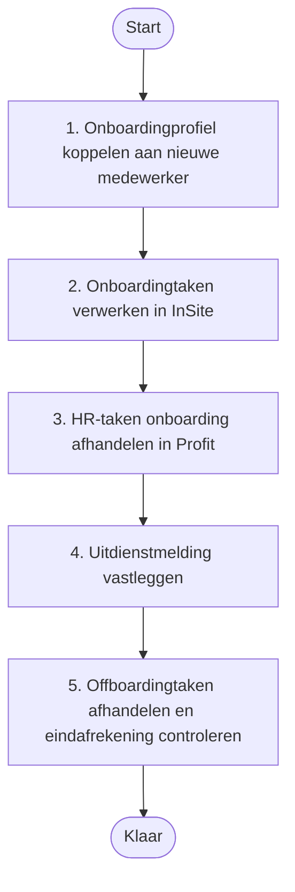

### Verlof- en verzuimregistratie

**Subonderdeel:** Verlof- en verzuimregistratie `(HRM_VERLOF)`

_Test het aanvragen, goedkeuren en registreren van verlof en verzuim via InSite en AFAS Profit, inclusief de saldocontrole en workflow-afhandeling._

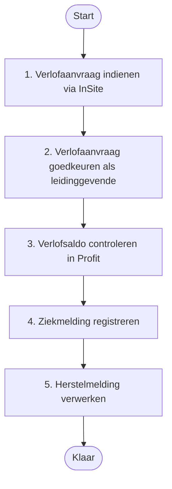

### Declaraties indienen en goedkeuren

**Subonderdeel:** Declaraties `(HRM_DECLARATIES)`

_Test het indienen, beoordelen en verwerken van medewerkerdeclaraties via InSite en AFAS Profit, inclusief workflow-goedkeuring en verwerking in de salarisrun._

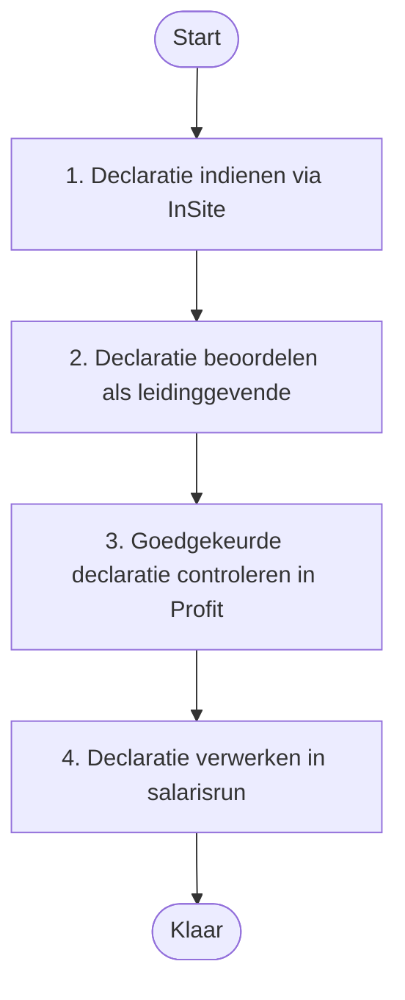

### Formatie en organisatie (organigram)

**Subonderdeel:** Formatie & organisatie (organigram) `(HRM_FORMATIE)`

_Test het inrichten en beheren van de organisatiestructuur, formatieplaatsen en bezettingsoverzichten in het AFAS Profit organigram._

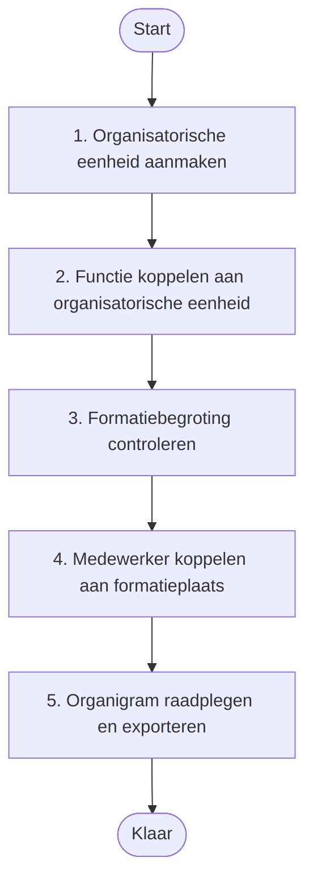

### Salarisverwerking (loonrun)

**Subonderdeel:** Salarisverwerking `(HRM_SALARIS)`

_Test het verwerken van een salarisperiode in AFAS Profit Payroll, van het controleren van mutaties tot het genereren van loonstroken en de betaalbestanden._

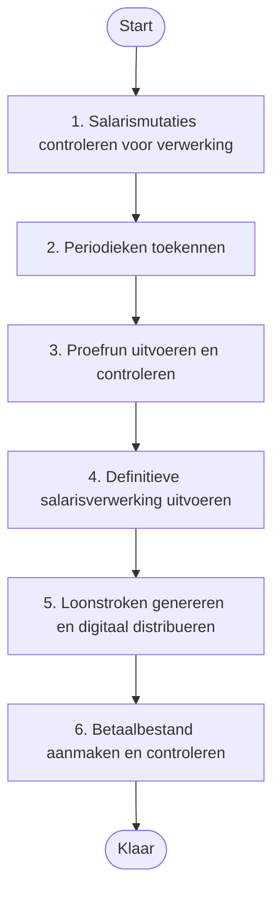

### CAO en looninrichting

**Subonderdeel:** CAO / looninrichting `(HRM_CAO)`

_Test het controleren en instellen van de CAO-parameters, looncomponenten en werkkostenregeling (WKR) in AFAS Profit Payroll._

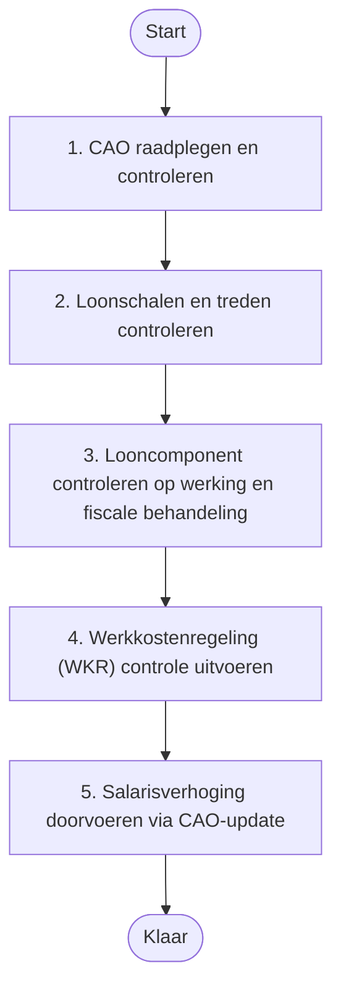

### Performance en talentmanagement

**Subonderdeel:** Performance / talentmanagement `(HRM_PERFORMANCE)`

_Test de gesprekkencyclus, beoordelingsworkflow en talentmanagementfuncties in AFAS Profit, inclusief het vastleggen van doelen, competenties en beoordelingen via InSite._

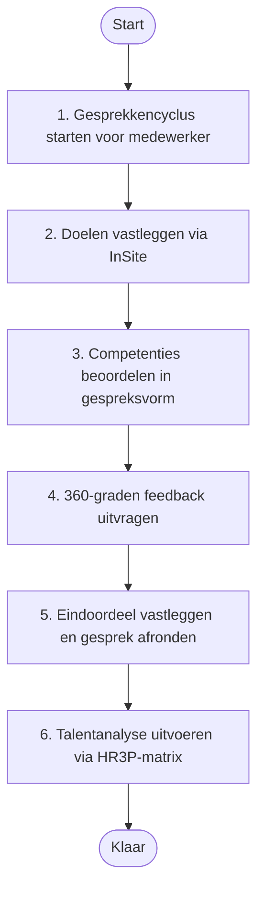

## 💰 Financieel

### Memoriaalboeking verwerken

**Subonderdeel:** Grootboekadministratie `(FIN_GROOTBOEK)`

_Test het aanmaken, controleren en definitief boeken van een handmatige journaalpost via het memoriaal dagboek in AFAS Profit Financieel._

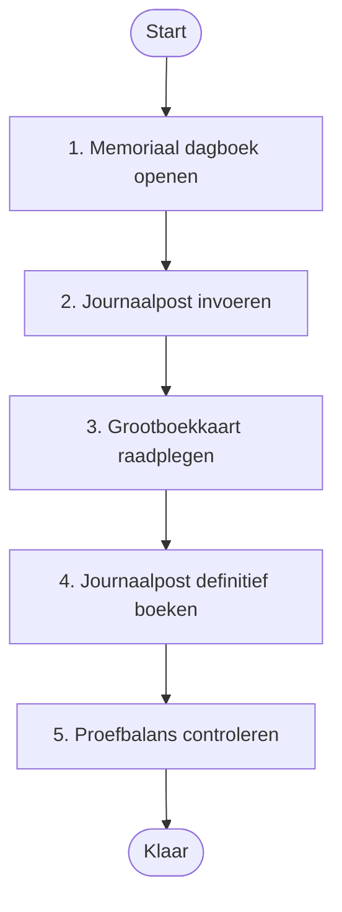

### Openstaande posten debiteuren en crediteuren bewaken

**Subonderdeel:** Debiteuren / crediteuren `(FIN_DEBCRED)`

_Test het raadplegen, bewaken en afstemmen van openstaande posten voor debiteuren en crediteuren in AFAS Profit Financieel._

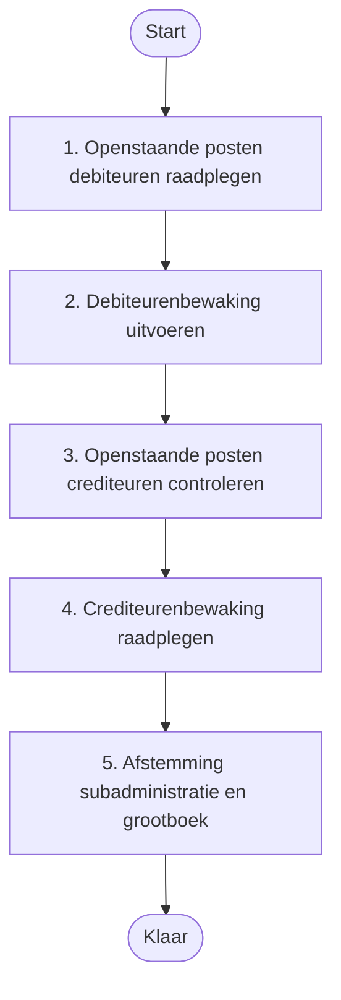

### Verkoopfactuur aanmaken en doorboeken

**Subonderdeel:** Facturatie `(FIN_FACTURATIE)`

_Test het aanmaken, controleren en financieel doorboeken van een verkoopfactuur in AFAS Profit via Ordermanagement en Financieel._

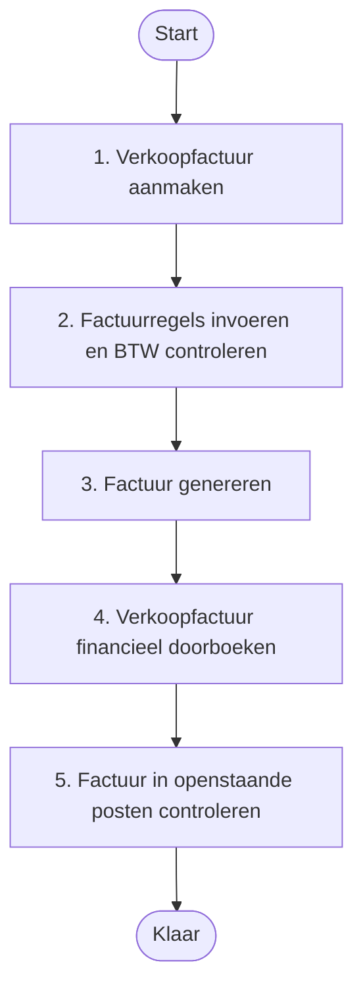

### Betaalbatch aanmaken en SEPA-bestand exporteren

**Subonderdeel:** Betalingen & bankkoppelingen `(FIN_BETALINGEN)`

_Test het samenstellen van een betaalopdracht voor crediteuren, het aanmaken van een SEPA-betaalbestand en de verwerking via de bankkoppeling in AFAS Profit._

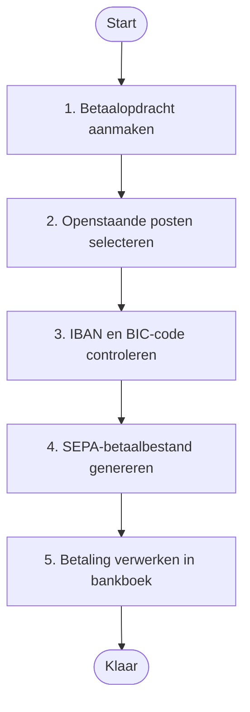

### BTW-aangifte opstellen en indienen

**Subonderdeel:** BTW / fiscale verwerking `(FIN_BTW)`

_Test het opstellen, controleren en elektronisch indienen van een BTW/ICP-aangifte voor een aangiftetijdvak in AFAS Profit Financieel._

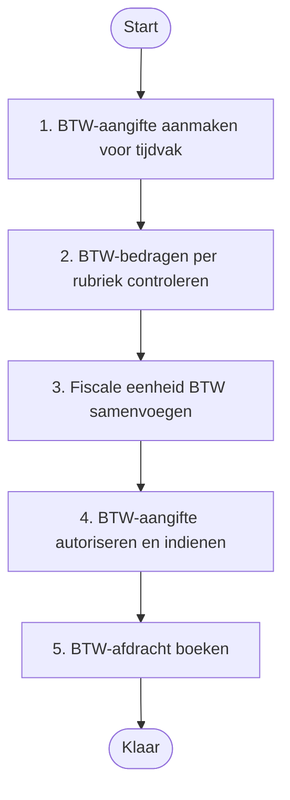

### Kostenverdeling via kostenplaatsen en kostendragers

**Subonderdeel:** Kostenplaatsen / kostendragers `(FIN_KOSTEN)`

_Test het toewijzen van kosten en opbrengsten aan kostenplaatsen en kostendragers (verbijzondering) bij het boeken en rapporteren in AFAS Profit Financieel._

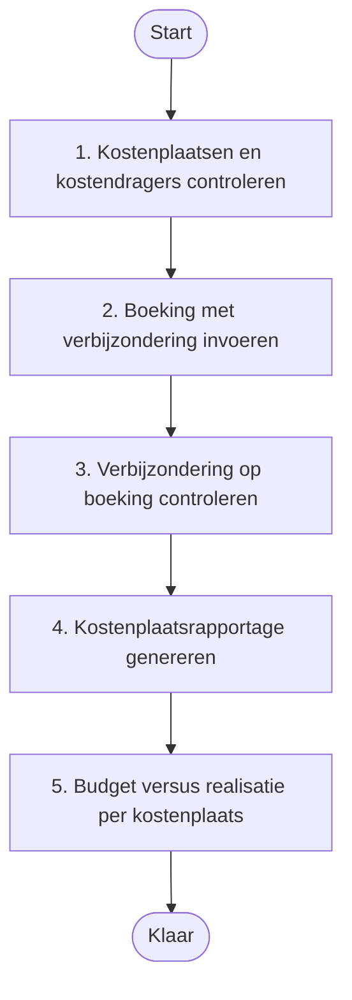

### Financiele rapportages en jaarrekening samenstellen

**Subonderdeel:** Rapportages & jaarrekening `(FIN_RAPPORTAGES)`

_Test het genereren van de balans, resultatenrekening en jaarrekening via de rapportagecockpit in AFAS Profit Financieel._

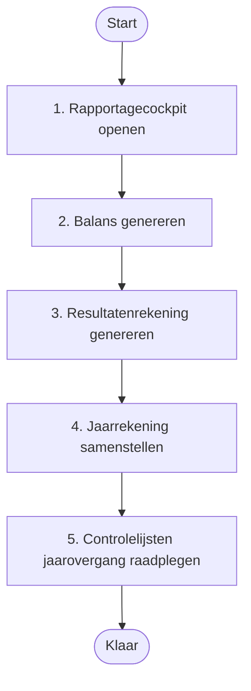

### Abonnementsfacturen periodiek genereren

**Subonderdeel:** Abonnementenfacturatie `(FIN_ABO)`

_Test het beheren van abonnementen, het periodiek genereren van abonnementsfacturen en de automatische financiele verwerking in AFAS Profit._

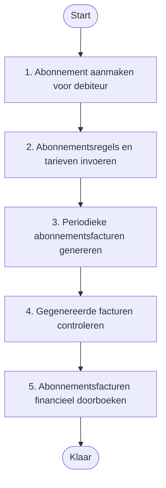

## 🤝 CRM

### Nieuwe relatie vastleggen

**Subonderdeel:** Relatiebeheer (debiteuren, crediteuren, prospects) `(CRM_RELATIES)`

_Test het aanmaken en beheren van organisaties, personen en prospects als relatie in AFAS Profit CRM, inclusief adresgegevens en relatietype._

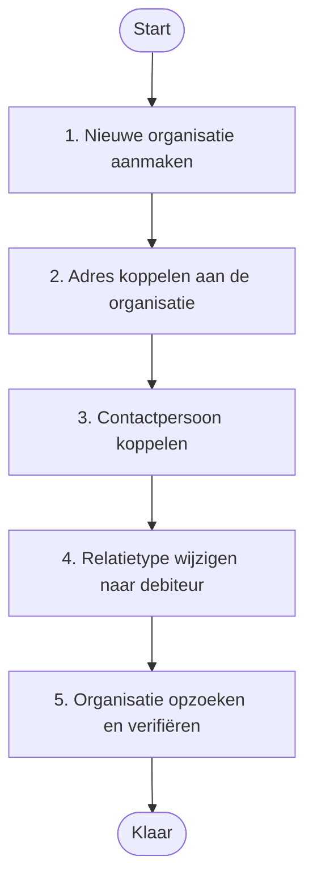

### Contactmoment registreren

**Subonderdeel:** Contactmomenten / communicatie `(CRM_CONTACT)`

_Test het vastleggen van contactmomenten en communicatie bij een relatie in AFAS Profit CRM, inclusief gespreksverslag en opvolgactie._

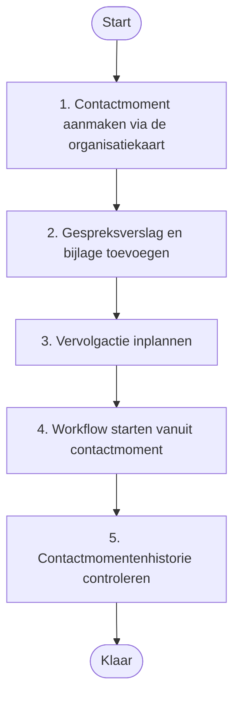

### Verkoopkans (forecast) beheren

**Subonderdeel:** Verkoopkansen (opportunities) `(CRM_VERKOOP)`

_Test het aanmaken en opvolgen van een verkoopkans in de AFAS Profit CRM-module Forecast, van lead tot offerte en afsluiting._

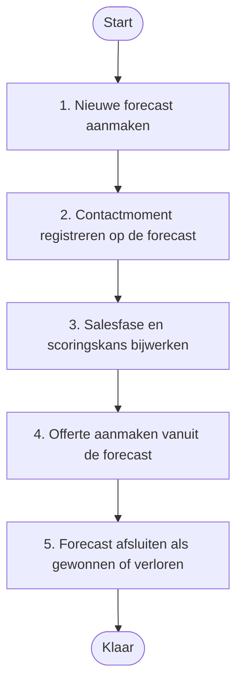

### Campagne aanmaken en uitvoeren

**Subonderdeel:** Campagnes & marketing `(CRM_CAMPAGNES)`

_Test het opzetten en uitvoeren van een marketingcampagne in AFAS Profit CRM, inclusief doelgroepselectie, campagneactie en e-mailmailing._

```mermaid
flowchart TD
  S([Start])
  N1["1. Nieuwe campagne aanmaken"]
  N2["2. Campagneactie toevoegen"]
  N3["3. Doelgroep bepalen via selectie"]
  N4["4. Campagneactie genereren"]
  N5["5. Campagneresultaat registreren"]
  E([Klaar])
  S --> N1
  N1 --> N2
  N2 --> N3
  N3 --> N4
  N4 --> N5
  N5 --> E
```

### Klantdossier beheren

**Subonderdeel:** Klantdossiers `(CRM_DOSSIERS)`

_Test het aanmaken, raadplegen en delen van dossieritems in het AFAS Profit klantdossier, zowel via Profit als via InSite en OutSite._

```mermaid
flowchart TD
  S([Start])
  N1["1. Dossieritem aanmaken bij een relatie"]
  N2["2. Dossieritem opzoeken via het dossieroverzicht"]
  N3["3. Dossieritem beschikbaar stellen via OutSite"]
  N4["4. Dossieritem raadplegen via InSite"]
  N5["5. Workflow starten vanuit dossieritem"]
  E([Klaar])
  S --> N1
  N1 --> N2
  N2 --> N3
  N3 --> N4
  N4 --> N5
  N5 --> E
```

## 📊 Projecten & uren

### Project aanmaken en inrichten

**Subonderdeel:** Projectadministratie `(PRJ_ADMIN)`

_Test of een nieuw project correct kan worden aangemaakt, ingedeeld in projectgroep en projectfases, en gekoppeld aan een verkooprelatie in AFAS Profit Projecten._

```mermaid
flowchart TD
  S([Start])
  N1["1. Projectgroep en projectprofiel controleren"]
  N2["2. Nieuw project aanmaken"]
  N3["3. Projectfases toevoegen"]
  N4["4. Projectmedewerkers koppelen"]
  N5["5. Voorcalculatie invullen"]
  N6["6. Projectstatus wijzigen naar Order"]
  E([Klaar])
  S --> N1
  N1 --> N2
  N2 --> N3
  N3 --> N4
  N4 --> N5
  N5 --> N6
  N6 --> E
```

### Urenregistratie via InSite

**Subonderdeel:** Urenregistratie `(PRJ_UREN)`

_Test of medewerkers via InSite uren kunnen boeken op een project met de juiste werksoort en projectfase, en of de accordering correct verloopt._

```mermaid
flowchart TD
  S([Start])
  N1["1. Urenscherm openen in InSite"]
  N2["2. Urenregel toevoegen op project"]
  N3["3. Urenregel opslaan en indienen"]
  N4["4. Uren accorderen als projectmanager"]
  N5["5. Geboekte uren controleren in Profit"]
  E([Klaar])
  S --> N1
  N1 --> N2
  N2 --> N3
  N3 --> N4
  N4 --> N5
  N5 --> E
```

### Budgetbewaking op projecten

**Subonderdeel:** Budgetbewaking `(PRJ_BUDGET)`

_Test of de budgetbewaking in AFAS Profit de afwijking tussen voorcalculatie (budget) en nacalculatie (werkelijk) correct bijhoudt en inzichtelijk maakt._

```mermaid
flowchart TD
  S([Start])
  N1["1. Voorcalculatiebudget raadplegen"]
  N2["2. Werkelijk geboekte kosten inzien"]
  N3["3. Budget vs. werkelijk vergelijken"]
  N4["4. Budgetoverschrijding simuleren en signaal controleren"]
  N5["5. Budgetoverzicht exporteren"]
  E([Klaar])
  S --> N1
  N1 --> N2
  N2 --> N3
  N3 --> N4
  N4 --> N5
  N5 --> E
```

### Nacalculatie boeken en verwerken

**Subonderdeel:** Nacalculatie `(PRJ_NACALC)`

_Test of projectkosten (uren, materiaal en overige kosten) correct als nacalculatie kunnen worden geboekt en verwerkt in AFAS Profit Projecten._

```mermaid
flowchart TD
  S([Start])
  N1["1. Nacalculatieregel voor uren aanmaken"]
  N2["2. Nacalculatieregel voor materiaalkosten aanmaken"]
  N3["3. Nacalculatieoverzicht per project raadplegen"]
  N4["4. Nacalculatie accorderen"]
  N5["5. Projectresultaten na nacalculatie controleren"]
  E([Klaar])
  S --> N1
  N1 --> N2
  N2 --> N3
  N3 --> N4
  N4 --> N5
  N5 --> E
```

### Resourceplanning en capaciteitsbewaking

**Subonderdeel:** Resourceplanning `(PRJ_RESOURCE)`

_Test of medewerkers correct aan projecten en projectfases kunnen worden gepland en of de capaciteitsbezetting inzichtelijk is in AFAS Profit Projecten._

```mermaid
flowchart TD
  S([Start])
  N1["1. Geplande uren per medewerker invoeren"]
  N2["2. Beschikbaarheid medewerker controleren"]
  N3["3. Capaciteitsconflict signaleren"]
  N4["4. Werksoort en rol toewijzen aan planningsregel"]
  N5["5. Geplande versus gerealiseerde uren vergelijken"]
  E([Klaar])
  S --> N1
  N1 --> N2
  N2 --> N3
  N3 --> N4
  N4 --> N5
  N5 --> E
```

### Projectfacturatie en termijnen

**Subonderdeel:** Projectfacturatie `(PRJ_FACTURATIE)`

_Test of projectfacturen correct worden gegenereerd via termijnen of factuurvoorstel en of de volledige facturatiecyclus in AFAS Profit Projecten correct verloopt._

```mermaid
flowchart TD
  S([Start])
  N1["1. Facturatiewijze op project instellen"]
  N2["2. Betalingstermijnen aanmaken"]
  N3["3. Factuurvoorstel aanmaken"]
  N4["4. Factuurvoorstel accorderen en definitief maken"]
  N5["5. Factuur verzenden en facturatiestatus controleren"]
  E([Klaar])
  S --> N1
  N1 --> N2
  N2 --> N3
  N3 --> N4
  N4 --> N5
  N5 --> E
```

### Projectrapportages en dashboards

**Subonderdeel:** Projectrapportages `(PRJ_RAPPORTAGES)`

_Test of projectrapportages en managementdashboards in AFAS Profit actuele en correcte inzichten bieden in voortgang, kosten, marge en prognose per project._

```mermaid
flowchart TD
  S([Start])
  N1["1. Projectresultatenrapport raadplegen"]
  N2["2. Projectendashboard openen en filteren"]
  N3["3. Voorcalculatie vs. nacalculatie per projectfase exporteren"]
  N4["4. Projectprognose-dashboard raadplegen"]
  N5["5. Nacalculatieoverzicht per medewerker raadplegen"]
  N6["6. Managementrapportage projecten genereren"]
  E([Klaar])
  S --> N1
  N1 --> N2
  N2 --> N3
  N3 --> N4
  N4 --> N5
  N5 --> N6
  N6 --> E
```

## 📦 Logistiek / ERP / Inkoop

### Inkooporder tot factuur (P2P)

**Subonderdeel:** Inkoop (P2P) `(LOG_INKOOP)`

_Test het volledige purchase-to-pay-proces: van het aanmaken van een inkooporder via ontvangst van goederen tot de 3-weg-confrontatie met de inkoopfactuur._

```mermaid
flowchart TD
  S([Start])
  N1["1. Inkooporder aanmaken"]
  N2["2. Inkooporder bevestigen"]
  N3["3. Ontvangst registreren"]
  N4["4. Inkoopfactuur boeken"]
  N5["5. 3-weg-confrontatie uitvoeren"]
  N6["6. Betaalbaarstelling controleren"]
  E([Klaar])
  S --> N1
  N1 --> N2
  N2 --> N3
  N3 --> N4
  N4 --> N5
  N5 --> N6
  N6 --> E
```

### Verkooporder tot factuur

**Subonderdeel:** Verkoop `(LOG_VERKOOP)`

_Test het verkoopproces van het aanmaken van een verkooporder tot en met het genereren en journaliseren van de verkoopfactuur._

```mermaid
flowchart TD
  S([Start])
  N1["1. Verkooporder aanmaken"]
  N2["2. Orderbevestiging versturen"]
  N3["3. Pakbon aanmaken"]
  N4["4. Pakbon gereedmelden"]
  N5["5. Verkoopfactuur genereren"]
  N6["6. Factuur journaliseren"]
  E([Klaar])
  S --> N1
  N1 --> N2
  N2 --> N3
  N3 --> N4
  N4 --> N5
  N5 --> N6
  N6 --> E
```

### Orderbeheer en orderopvolging

**Subonderdeel:** Orderbeheer `(LOG_ORDERS)`

_Test het beheren en opvolgen van verkoop- en inkooporders, inclusief statusbewaking, orderwijzigingen en het verwerken van een bestelvoorstel._

```mermaid
flowchart TD
  S([Start])
  N1["1. Bestelvoorstel genereren"]
  N2["2. Bestelvoorstel omzetten naar inkooporder"]
  N3["3. Verkooporder wijzigen"]
  N4["4. Openstaande orders bewaken"]
  N5["5. Verkooporder annuleren"]
  E([Klaar])
  S --> N1
  N1 --> N2
  N2 --> N3
  N3 --> N4
  N4 --> N5
  N5 --> E
```

### Voorraadbeheer en voorraadmutaties

**Subonderdeel:** Voorraadbeheer `(LOG_VOORRAAD)`

_Test het bijhouden en muteren van de artikelvoorraad, inclusief voorraadcorrecties, voorraadtelling en inzicht via het voorraadoverzicht._

```mermaid
flowchart TD
  S([Start])
  N1["1. Artikel controleren op voorraadprofiel"]
  N2["2. Actuele voorraad raadplegen"]
  N3["3. Handmatige voorraadmutatie invoeren"]
  N4["4. Tellijst genereren voor voorraadtelling"]
  N5["5. Voorraadtelling verwerken"]
  E([Klaar])
  S --> N1
  N1 --> N2
  N2 --> N3
  N3 --> N4
  N4 --> N5
  N5 --> E
```

### Magazijnbeheer en picken (WMS)

**Subonderdeel:** Magazijnbeheer (WMS) `(LOG_MAGAZIJN)`

_Test het magazijnbeheerproces inclusief locatiebeheer, het aanmaken van een picklijst vanuit een pakbon en het verwerken van een magazijnverplaatsing._

```mermaid
flowchart TD
  S([Start])
  N1["1. Magazijn en locaties controleren"]
  N2["2. Picklijst aanmaken vanuit pakbon"]
  N3["3. Picken registreren"]
  N4["4. Magazijnverplaatsing uitvoeren"]
  N5["5. Pakbon gereedmelden na picken"]
  E([Klaar])
  S --> N1
  N1 --> N2
  N2 --> N3
  N3 --> N4
  N4 --> N5
  N5 --> E
```

### Productie en assemblage (beperkt)

**Subonderdeel:** Productie / assemblage (beperkt) `(LOG_PRODUCTIE)`

_Test het beperkte productie- en assemblageproces: van het controleren van de stuklijst via het aanmaken van een productieorder tot het verwerken van de productiebon._

```mermaid
flowchart TD
  S([Start])
  N1["1. Samengesteld artikel en stuklijst controleren"]
  N2["2. Productieorder aanmaken"]
  N3["3. Componentbeschikbaarheid controleren"]
  N4["4. Productiebon aanmaken"]
  N5["5. Productieorder afsluiten"]
  E([Klaar])
  S --> N1
  N1 --> N2
  N2 --> N3
  N3 --> N4
  N4 --> N5
  N5 --> E
```

### Leveringen en logistiek

**Subonderdeel:** Leveringen & logistiek `(LOG_LEVERINGEN)`

_Test het leveringsproces inclusief het automatisch genereren van pakbonnen, verzendgereedmelding, transportkoppeling en het afhandelen van een retourlevering._

```mermaid
flowchart TD
  S([Start])
  N1["1. Pakbonnen automatisch genereren"]
  N2["2. Pakbon afdrukken"]
  N3["3. Verzending gereedmelden"]
  N4["4. Track-en-trace-code controleren"]
  N5["5. Retourlevering registreren"]
  E([Klaar])
  S --> N1
  N1 --> N2
  N2 --> N3
  N3 --> N4
  N4 --> N5
  N5 --> E
```

